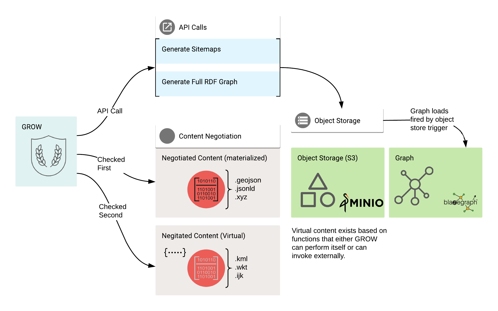
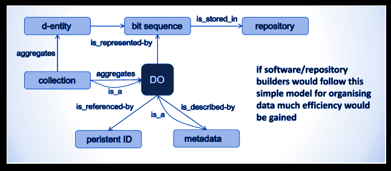
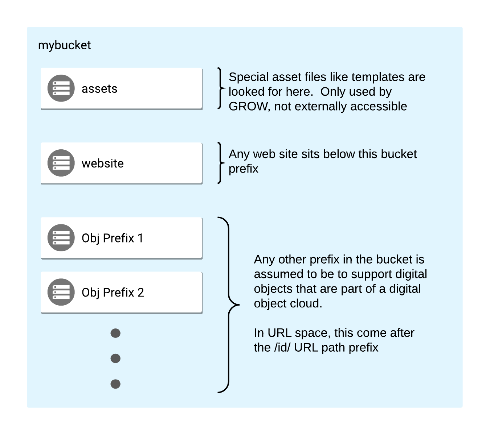

# GROW


## Summary
GROW stands for "Generic Resource on the Web", succinctly, it is a web server
that leverages object storage. 

* GROW uses an object store system that implements the S3 API (So Minio, Google Cloud, AWS, etc)
* GROW maps these objects to URL patterns and maps negotiated content formats to the objects and 
also functions in or linked to GROW
* GROW is a single binary, easily containerized and cloud ready




## Why GROW

There is actually nothing overly special about
GROW's approach. The approach could and has been implemented in other environments.   So
what made GROW unique enough to be worth coding?

A few things:

* GROW was an attempt to implement the RDA Digital Object Cloud pattern in a
  server focused on serving digital objects.
* GROW also implements structured data on the web approaches.  Specifically,
  including JSON-LD data graphs in landing pages associated with a digital
  object. 
* GROW can interpret potential "affordances for resources" .  Here,
  "affordances" means operations the digital object could satisfy.  This is
  mostly just content negotiation extended to include those content formats that
  can be computed as well as those already materialized.  Though not implemented
  yet, GROW will also express those paths via web architecture patterns in
  response to client requests.   That is to say, it will respond with the
  formats a resource accepts and also, in a TBD manner, those affordances the
  resources can satisfy.  
* As noted above, negotiated views can be optionally dynamic or static.  Either
  code functions that compute and send the results, or results pre-computed and
  available in the object store. 
* GROW was also designed to optimize indexing over the web in support of
  structured data on the web.  So it is highly concurrent and designed to
  operate at high sustained loads.  Coupled with an http 2.0 aware proxy (like
  Traefik) and backed by a fast object store (like Minio) GROW should perform
  well.  Also, it's containerized and has been deployed to Google Cloud Run
  backed by Google Cloud Storage.  Via Google Cloud Run it should scale out well
  as well.  

These patterns are designed to express not only the RDA Digital Object Cloud
pattern but also help address FAIR data principles as much as possible.
Inspiration was also taken from the Digital Object Internet Protocol (DOIP)
work. 




## Principle of Project

As noted, this approach could be replicated in other
environments.  Most of what is expressed by GROW are patterns and principles.
Building this via other packages and systems should be relatively easy.  Go was
used to provide single static binaries that lend themselves well to
containerization and cloud scaling.  


## Objects by Convention

A pattern that evolved out of this work was what could
be described as "objects by convention".   Analogous to the "Convention over
Configuration" approaches in coding, which attempted to reduce the amount of
configuration a framework required by establishing a convention that everyone
follows.   The main driver for the convention was to express an alignment
between web/URI space to object space.   This is mostly to provide a smooth
approach to Linked Open Data patterns. 



The default object prefix for web site resources is "website"

Generically then:

| URL                                 | Bucket                    |
| ----------------------------------- |-------------------------|
| ``` https://example.org/[…]```      | ```mybucke/website```     |

So:


| URL                                 | Bucket                    |
| ----------------------------------- |-------------------------|
| ```https://example.org/info/aboutus.html```      | ```mybucket/website/info/aboutus.html```     |


This mapping is for all resources like .js, .css and other files for a website.
Note the special case of a URL that is a "directory" GROW will look for the
index.html file in the directory.


So:  ```https://example.org/help```


| URL                           | resolves as          | Bucket                  |
| ------------------------------|----------------------|-------------------------|
| ```https://example.org/help```|```https://example.org/help/index.html```| ```mybucket/website/help/index.html```     |


## /id/ 

The driving use case for GROW was really to address publishing digital
objects.  These could be documents, data packages or other items.  Also, the
pattern as defined by the RDA Digital Object Cloud meant that we would have
associated metadata files with them.  

I needed a way to ensure that URLs meant to be part of the web, were separate
from data object URLs.  Mostly this is due to negotiated views and special
computed workflows I will detail later.  I needed a default namespace that
separated the two, and I settled on a "convention" I have used for some time.
The /id/ URL path prefix.

Anything without /id/ at the start of the path, is a resource intended for the
web and follow the pattern above.  Any URL that represents a digital object,
will start its path with an /id/.  Note, you can configure this prefix (so..
configuration over convention I guess)  ;)

Object Store structure. So how does this map into object storage?  Let's look at
a few examples.

A example:

| URL                                                     | Object (Bucket +  Prefix)                  |
|---------------------------------------------------------|--------------------------------------------|
| ```https://example.org/id/artifact/gaurdianofforever``` | ```/mybucket/artifact/gaurdianofforever``` |

You will note we didn't map the ID name.  This was due to the fact we wanted
people to be able to set their own prefix and also a few other routing thoughts.

## /assets

There is one last special "convent" object prefix and that is
"assets".  I reserved that name for objects the server might need to satisfy an
operation.  The driving example was for template files to address server side
rendering of pages.  I'll detail this in the object request routing. 

## Object Request Routing

As noted, we are implementing a pattern where an
object exists and has a corresponding metadata file.   So any file like
"example.xyz" has a metadata file "example.jsonld".

NOTE:  For GROW, the current implementation assumes metadata is JSON-LD,
implementing the RDF data model.   This effectively exposes the capacity of the
semantic web for metadata.  It would be possible to do this for ISO metadata for
example, but at this time GROW does not.  

So let's look at our example from above:

```id/artifact/guardianofforever```

is an object.  Again, following the RDA Digital object pattern we need a
metadata object for it.  

That said then.  Let's look at two requests for this object.

The simple..  explicate format. Any explicitly suffixed request will look for
that object directory.

```
id/artifact/guardianofforever.html  ->  html page on the Guardian
id/artifact/guardianofforever.josnld -> JSON-LD about the Guardian
id/artifact/guardianofforever.wkt -> Stellar coordinate for Guardian
```

> Does suffix overrides headers?  No, the suffix of a URL
> does not take precedence over the request HEADER.  This is being reviewed 
> as it can be confusing.  x.jsonld requested via a web browser (which always sends text/html)
> is presented as an HTML page not JSON-LD in the browser. 


## Negotiated requests

Negotiated requests are those requests for content that
state their content type in the request header.  The would be on the object base
name only.

| Request HEADER                 | on                                          | Response                  |
|--------------------------------|---------------------------------------------|---------------------------|
| ```text/html```                | ```id/artifact/guardianofforever```         | HTML                      |
| ```nil```                      | ```id/artifact/guardianofforever.html```    | HTML                      |
| ```application/ld+json```      | ```id/artifact/guardianofforever```         | JSON-LD                   |
| ```nil```                      | ```id/artifact/guardianofforever```         | Raw byte stream of object |
| ```application/octet-stream``` | ```id/artifact/guardianofforever```         | Raw byte stream of object |
| ```nil```                      | ```id/artifact/guardianofforever.jsonld```  | JSON-LD                   |
| ```nil```                      | ```id/artifact/guardianofforever.geojson``` | GeoJSON                   |


As noted above the HEADER overrides the suffix.  So:

| Request HEADER             | on                                         | Response |
|----------------------------|--------------------------------------------|----------|
| ```application/ld+json```  | ```id/artifact/guardianofforever.html```   | JSON-LD  |
| ```application/geo+json``` | ```id/artifact/guardianofforever.jsonld``` | GeoJSON  |


## Materialize and Computed content responses 

One area I wanted to experiment
with in GROW (and again, this is not unique to GROW) is dealing with requests
for object serializations that may or may not be materialized.

What does that mean in English?

Grow is configured such that a request for say .geojson on a resource (either by
content negotiation or suffix mapping) gets resolved two ways.

STEP 1
| Request                     | look for object                    | Action                     |
|-----------------------------|------------------------------------|----------------------------|
| ```id/artifact/X.geojson``` | ```/mybucket/artifact/X.geojson``` | If found, send that object |


However, we may not have a pre-computed GeoJSON for X.  That is, that
object is not actually in the object store.  You would expect GROW to now return
an error 415 (unsupported media type).  

> Note, 404 (not found) would be returned
> if NO version at all of the base object name "artifact/X"
> exists.

For GROW, however, there is one more option before that.  While the object store
is checked first, a fall back is to look to see if a function has been coded in
GROW (and in the future, external to GROW)  that allows that view to be
computed.  

STEP 2
| Request                     | Object not found, look for function | Action       |
|-----------------------------|-------------------------------------|--------------|
| ```id/artifact/X.geojson``` | JSONLD2GeoJSON function found                     | Send results |

Here GROW has a function that will attempt to generate GeoJSON from JSON-LD.
GROW will perform the function and if it can generate GeoJSON will sends the results.  Failing
that, it will again send 415 (unsupported media type) or appropriate code on 
the results of the computational request.


Why do this, wouldn't it always be slower?

* If I have 3 million objects, I might only store views that are very commonly
  requested or require a lot of computation.  I might not want to store every
  possible combination of a files encoding.
* Less common and/or very quickly computed views I might choose to compute and
  send.
* I can also mix and match, GROW checks for the existence of a computed view
  first, even if the compute function exists.
* Also, this pattern allows me to leverage external functions that I might be
  able to incorporate.  (Looking at how to do this in a "web architectural"
  approach now).

So, GROW can serve simple documents but for the special case of "digital
objects" it looks for views that are computed first and then looks to see if it
can generate that format.  Failing all that it returns 415 (or other errors of
course for internal error (500), or if the base object doesn't exist at all
(404)). 

## Special Case "Landing Page"

The last topic is the special case of the
"landing page". In the above examples we noted the request for .html and the
subsequent response.  It would be completely feasible to pre-render the HTML
(ala Hugo or other such means) and place that HTML in the object store to be
picked up first based on the previous description.

> NOTE:  If you use Hugo or other generation systems that will work fine.  
> GROW will default to pre-computed views over any computed views.

However, GROW does also provide for using HTML templates (GROW is written in Go,
so these are standard Go templates).  

Why do this? It means that users of Grow can follow just the RDA Digital Object
Cloud pattern mentioned earlier.  Putting a digital object (of any format) into
the object store, along with a corresponding .JSON-LD file means that object can
be shared and a basic landing page generated for it without any work.  Also, all
computed views that can be supported by the .JSON-LD content are also available.

This was a key goal.  To allow the data provider to focus on the data and the
descriptive metadata for it.  The key elements they are authoritative for, and
have GROW do as much out of box as it can while still allowing them to add other
materialized views later. 

So in this case a template.html file is looked for in the "assets" directory at
the same path in there as the resource has.  So

id/artifact/X.html means, first we look for that object...  not
finding it already existing.... we look for

mybucket/assets/artifact/template.html and mybucket/artifact/X.jsonld

These are combined to make: id/artifact/X.html

Summarizing (assuming no precomputed .html):
| Request       | Check for Object    | Look for JSON-LD           | Look for Template                      | Results                |
|---------------|---------------------|----------------------------|----------------------------------------|------------------------|
| id/artifact/X | mybucket/artifact/X | mybucket/artifact/X.jsonld | mybucket/assets/artifact/template.html | Generate and send HTML |

The generated HTM will also have the .JSON-LD placed into the head of the document.  

Out of scope for this document, we then can leverage web components to present human usable views into
that JSON-LD like maps, tables, plots, etc.   This is analogous in some ways to
the Jamstack model.

## Q & A

Q: Why not just use AWS Lambda functions for web sites...  hasn't this been
done? 

A: Agreed and it would be easy(ish) to implement this in that environment.
I'm not sure all the routes and moving parts are as easy to maintain in AWS land
as in static binary land.   It is just a pattern though, so yes you could.
However, I wanted something I could deploy locally as a binary or simple OCI
container in Docker or Podman.  Or, deploy into something like Google Cloud Run.
I wanted options,

Q: Does this scale? 

A: Everything is containerized and stateless, so it should
scale easily in k8s or docker environments.   It's been deployed to Google Cloud
run too (essentially managed k8s) and so there (like other clouds) you can set
thresholds that when reached start the scale out process (and scale back. 

Q: Why don't you use 303 redirection to not conflate URIs and URLs of resources?

A: I know..  I thought of that at the start..   but who is doing that?   It
seems wonderful in the "logic" space but a pain in the ass in the user space
where my clients now need to be 303 aware for loading resources in notebooks
etc.   I choose to make one camp happy over another since it seemed unlikely
either could be equally happy. 

Q: What if my Digital Object is only one file? There is no associated metada
(.jsonld) or my file is a .jsonld? 

A: Then your file is resolved directly as
either file.EXT or file. If it is not file.jsonld, it would be sent directly as
a byte stream. If it is file.jsonld, it will be sent as a byte stream unless
requested as text/html. If requested as text/html we will look for a template
and generate the html. If there is no template, it will be sent as a byte stream
(application/ld+json)


