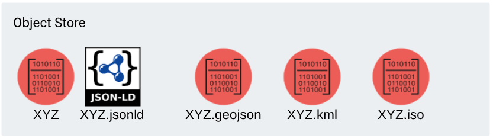
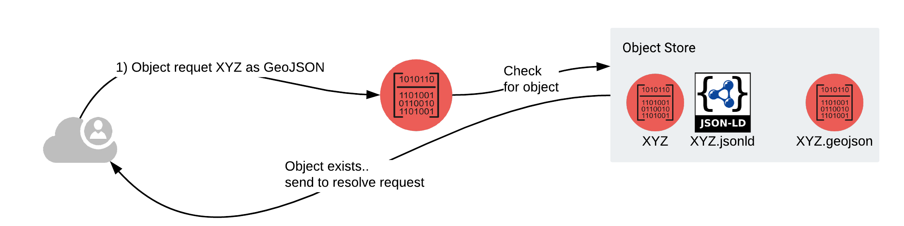
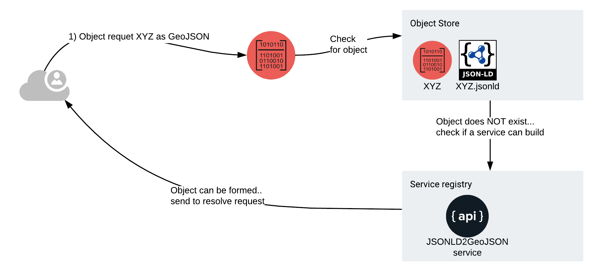

# GROW Affordance concept

## TLDR

Currently, Grow has a basic ability to map internal functions to digital objects. 
There looks to be a path to mapping external services too.  Allowing us to express 
potential connections between objects and services in a tool we can play in.  
So lets leverage this to provide an area where we can develop, test and iterate 
on approaches to mapping objects and services. 


## Background

Affordance is described as "What the environment offers
the individual".  We can apply this in GROW to say "what the digital document 
offers the requester"   Currently, GROW mediates documents and their associated 
metadata documents following the RDA Digital Object Cloud pattern. 


It's easy to see a case where we have various
representations of these digital objects people may request.  
For example, We might have an document XYZ, perhaps in some binary format and its
associated JSON-LD metadata object.  We might also have _representations_ of XYZ
in geojson, kml or ISO formats.   



It's easy to map a HHTP request for XYZ.geojson then to the representation of XYZ
requested.  Either through URL extension or explicate content negotiation via
ACCEPT headers. 



What if the requested .geojson file didn't exist but we had a service that could
look into the JSON-LD and return a GeoJSON object?  Assuming the JSON-LD contained the
necessary information to satisfy such a computation (failure to compute might
result in a 415 Unsupported Media Type… this is open for discussion of course.).

Assuming no 400 or 500 issues such a process might look like:



Here the request for a GeoJSON can not be satisfied with a pre-computed
view, but can be transformed on the fly to reconcile the request.  


### Example
A very hackish implementation of this exist.  Again, this is calling a built in function 
in the Go code.  GROW has some basic (and fragile) logic to convert JSON-LD to GeoJSON 
assuming sufficient elements are present.  The mapping is made in *code* logic, not 
expressed in an external logic like schema.org or other vocabularies. 

That in mind, using https://samples.earth/id/do/bqs2du2u6s73o70jg1r0 as an example.

```bash
curl https://samples.earth/id/do/bqs2du2u6s73o70jg1r0 
```
Return JSON-LD document

```bash
curl https://samples.earth/id/do/bqs2du2u6s73o70jg1r0.geojson 
```
Returns a GeoJSON document.  We can have also content negotiated on the base URL
with no extension with application/geo+json to get the later.  

As an aside, these are the sort of things where a SHACL file would be able to test 
if a JSON-LD data graph has the elements to satisfy a function call.  

This "baked into the code" approach is not the solution.

## Proposal

A better way would that the same way GROW is able to address digital object and
its JSON-LD metadata would be used.  GROW would have JSON-LD document describing
services. These documents and services would be described in such a way that we
could align them and perform the call.  Nothing fancy no chaining (yet).  

This has been done before and tried before.  So what makes this worth trying
again?

* With Science on Schema and other development in schema.org the state of the
  art has evolved.
* With GROW, we have an easy playground to experiment with this approach.
  Indeed, this test scenario was one reason for building GROW to begin with.  


I would like to work with a group to define out some simple examples of services
that work on JSON-LD (for now) and convert that to other formats.  These 
services would be described in JSON-LD and be able to be interpreted by GROW 
such that GROW would express these as new representations for a digital
document resource.  

For example, extracting a list of colors present in a PNG file.  The 
target object would be a simple PNG file and the results would be a simple
JSON file listing all the colors present in the file. This is just a proof 
of concept service that is easy to set up.


### Pass by

Trying to map service verbs and elements and resolve the semantics of what those 
verbs and parameters do just seems too hard.  (grin)    It's what likely has sunk 
many such ships in the past.  

For a 0th order implementation I'd suggest  a service simply performs some unit 
of work on an object.  The service requires no detailed guidance though some 
parameters may be passed for simple aspects like setting bounding boxes or 
providing basic input parameters.    The real key being parameters don't alter 
the operation.  That would simply be a new services.  The real key would be good 
descriptions of what the service does in human readable form.

In such a case GROW simply can pass the object as;

* POST body to the service with perhaps some optional parameters but hopefully none.  
* GET call with reference to the URL of the object.  (perhaps via [JSON:API](https://jsonapi.org/) )


Think more like [Web Share API](https://w3c.github.io/web-share/#share-method) than brokering services. 

### Implementation approaches

#### By Hash

```
curl localhost:8080/id/ex/greyPattern.jpg/3d4a4992f64b7f902f4105dc7e92090b
or
curl localhost:8080/id/ex/kjsdjsd89567sdbn2312hjkdkl/3d4a4992f64b7f902f4105dc7e92090b

pattern is 
curl localhost:8080/id/[OBJECT_PATH]/[OBJECT_HASH]/[SERVICE_DESCRIPTOR_HASH]


```

#### By URL Params
```
curl localhost:8080/id/ex/greyPattern.jpg?s=[SERVICE_ID]
or
curl localhost:8080/id/ex/greyPattern.jpg?s=[SERVICE_ID_HASH]

pattern is 
curl localhost:8080/id/[OBJECT_PATH]/[OBJECT_HASH]?s=[SERVICE_ID or SERVICE_ID_HASH]


```

The real question is should the service call be part of the base URL for the object, 
implying it is more of a distinct resource.  Or, should we leverage the URL 
structure to more explicitly state that the product of the URL is a service call. 

# Appendix 

## References 

* https://github.com/fils/goobjectweb/blob/master/docs/about.md
* https://github.com/fils/goobjectweb/blob/master/docs/sources.md
* https://www.dona.net/sites/default/files/2018-11/DOIPv2Spec_1.pdf

## Ideas & Notes

Perhaps JSON-API as a standard message envelope?  Lacks binary
support but we can pass that by reference with the DOC + LOD pattern.

A generic broker is too complex..  has been tried before and failed!   I'd be
more interested in something more like web share API and passing the object as a
byte stream POST call. Easy to encode into Go perform.  


Idea for listing avilable operations on an object
```bash
curl https://samples.earth/id/do/bqs2du2u6s73o70jg1r0/Op.listOperations
```

Idea for explicate service on an object.   Why do this if 
we are aligning content types to associated objects and services?
```bash
curl https://samples.earth/id/do/bqs2du2u6s73o70jg1r0/serviceX  
```


| Object presents mimetype and/or a semantic Type | Service declares ops on mimetypes and or semantic types           
| ------------- |-------------
| r1     | Service present a SHACL that defines elements in a JSON-LD of a DO that express its usability     
| r2      | Leverage profiles for this? https://www.w3.org/TR/dx-prof/ and https://www.w3.org/TR/dx-prof-conneg/


